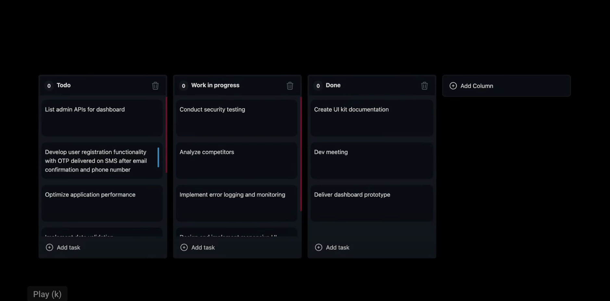

# React TypeScript Kanban Board with Dnd Kit

This project is a simple Kanban Board application built using React, TypeScript, and the Dnd Kit library. Users can manage tasks by dragging and dropping them between columns.

## Demo

## Features

- **Drag and Drop**: Easily move tasks between different columns using Dnd Kit.
- **Column Management**: Add, delete, or rename columns as needed.
- **Task Creation**: Create new tasks within columns with a simple interface.

## Technologies Used

- **React**: A popular JavaScript library for building user interfaces.
- **TypeScript**: A statically typed superset of JavaScript.
- **Dnd Kit**: A modern, lightweight, performant and extensible drag & drop library.

## Usage

1. Visit `http://localhost:3000` in your browser.
2. Use the interface to add, rename, or delete columns.
3. Create tasks within columns by clicking on the "+" button.
4. Drag and drop tasks between columns to manage them.

## Contributing

Pull requests are welcome. For major changes, please open an issue first to discuss what you would like to change.

## License

This project is licensed under the MIT License. See the [LICENSE](LICENSE) file for details.
